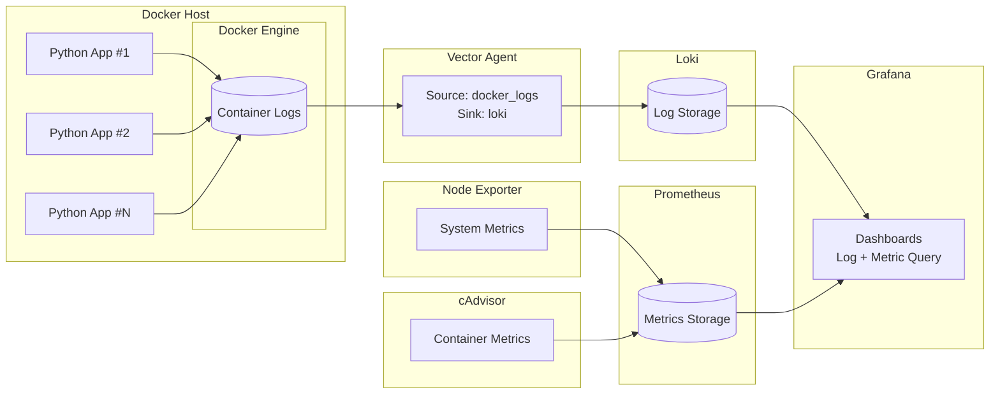

# monitoring

로그 + 메트릭 통합 모니터링을 위한 Docker 기반 프로젝트.

주요 구성 요소
- Vector: Docker 컨테이너 로그 수집
- Loki: 로그 저장소
- Prometheus: 메트릭 저장소
- Node Exporter: 호스트 서버 메트릭 수집
- cAdvisor: 컨테이너 리소스 메트릭 수집
- Grafana: 로그 및 메트릭 대시보드

Reverse Proxy (NGINX) ──▶ Grafana (:3000)
